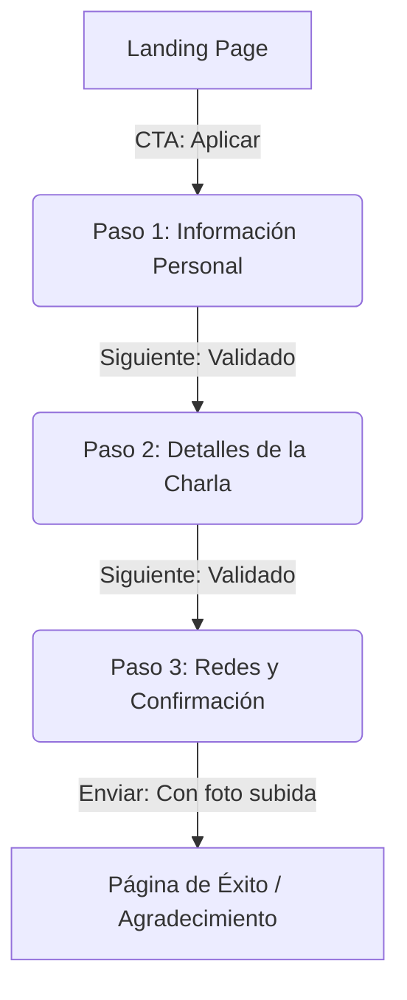

# Plan de Implementación: Plataforma de Call for Speakers - Angular Bolivia

Este documento presenta la propuesta arquitectónica y de diseño para la plataforma web de convocatoria de speakers para **Angular Bolivia**.

---

## 1. Arquitectura y Stack Tecnológico

### Frontend: Angular (Prácticas Modernas)
- **Framework**: Angular 18+ con modo **Standalone** por defecto (sin `NgModule`).
- **State Management**: Angular **Signals** para manejar el estado reactivo del formulario multi-paso y los estados de autenticación del administrador.
- **Routing**: Lazy loading para rutas independientes (Landing, Formulario de Aplicación, Login, Dashboard de Admin).
- **Formularios**: **Reactive Forms** avanzados con tipado estricto, validadores asíncronos y síncronos personalizados.
- **Renderizado / Flujo de Control**: Nueva sintaxis nativa `@if`, `@for`, `@switch` para un rendimiento óptimo y legibilidad.
- **Estilos**: Vanilla CSS con variables CSS personalizadas para implementar un diseño moderno (Modo oscuro, gradientes modernos y micro-animaciones) conforme a los estándares de la comunidad.

### Backend: Firebase
- **Firebase Authentication**: Inicio de sesión administrativo mediante Email/Password.
- **Cloud Firestore**: Almacenamiento no relacional para los datos de los aplicantes.
- **Cloud Storage**: Almacenamiento seguro para las fotos de perfil de los candidatos.
- **Security Rules**: Restricción de lectura de datos sensibles a nivel de base de datos y Storage, permitiendo la creación pública de solicitudes pero validando su estructura estrictamente en el servidor.

---

## 2. Flujo de Experiencia de Usuario (UX/UI) y Diseño

El diseño de la aplicación será premium, responsivo y dinámico, adaptado a la identidad de Angular Bolivia (rojo/ginda/azul oscuro de Angular y la marca local, con soporte para modo oscuro/claro optimizado).

### A. Página de Inicio (Landing Page)
1. **Sección Hero**:
   - Título impactante y dinámico con gradiente: *"Comparte tu pasión por Angular con la comunidad"*.
   - Call to Action (CTA) destacado para aplicar.
2. **Información de Angular Bolivia**:
   - > *"Nuestros meetups son espacios de intercambio y aprendizaje, en los que abordamos temas relacionados con la industria del desarrollo de software: desde el desarrollo con Angular y herramientas de software, hasta diseño UX/UI y programación en general. Buscamos speakers que puedan disertar charlas dinámicas, conducir debates enriquecedores y ofrecer a nuestros asistentes, la oportunidad para expandir sus conocimientos."*
3. **Temas Sugeridos**:
   - Lista visualmente atractiva en forma de "tags" dinámicos:
     - Angular & Desarrollo Web.
     - Herramientas para desarrolladores de software.
     - UX/UI Design.
     - Programación en general.
     - Inteligencia Artificial aplicada a la Web.
     - Inteligencia Artificial general.
4. **Beneficios de ser Speaker**:
   - Visibilidad y posicionamiento en la comunidad regional y global de Angular.
   - Espacio para networking con profesionales de la industria.
   - Grabación de la charla y publicación en el canal de YouTube de Angular Bolivia.
   - Acceso a mentores/coaching técnico previo al evento para pulir la presentación.
5. **Requisitos y Expectativas**:
   - *"Disponibilidad de tiempo el día y hora del evento: En caso seleccionemos tu charla, nos contactaremos contigo con anticipación para saber si tienes disponibilidad para participar de nuestro próximo meetup."*
   - *"Ganas de compartir tu conocimiento y pasar un buen rato con la comunidad."*

### B. Formulario de Aplicación Multi-Paso (Step-by-Step Wizard)
El formulario se divide en 3 pasos para evitar la fatiga del usuario y garantizar una experiencia fluida.



- **Indicador de Progreso**: Barra superior interactiva con transiciones suaves de estado (Completado, Activo, Pendiente).
- **Validación al interactuar (`:user-invalid`)**: Los mensajes de error solo aparecerán cuando el usuario intente avanzar de paso o deje de interactuar con un campo (`blur`), evitando el ruido visual de errores prematuros mientras escribe.

---

## 3. Estructura de Datos (Modelos)

### Modelo de Aplicante (Firestore: `applicants/{applicantId}`)

```typescript
export interface Applicant {
  id?: string;
  createdAt: any; // Timestamp del servidor
  
  // Paso 1: Información Personal
  fullName: string;
  email: string;
  phone: string;
  countryOfOrigin: string;
  countryOfResidence: string;
  bio: string;
  photoUrl: string; // URL pública del Storage
  photoStoragePath: string; // Referencia interna en Storage para limpieza
  
  // Paso 2: Detalles de la Charla
  talkTitle: string;
  talkDescription: string;
  duration: 15 | 30 | 60;
  type: 'talk' | 'workshop';
  level: 'beginner' | 'intermediate' | 'advanced';
  
  // Paso 3: Redes y Enlaces
  socialLinks: {
    twitter?: string;
    linkedin?: string;
    github?: string;
  };
  website?: string;
  repository?: string;
  
  // Términos aceptados
  acceptedTerms: boolean;
  
  // Estado interno para el admin
  status: 'pending' | 'reviewing' | 'accepted' | 'waitlist' | 'rejected';
  adminNotes?: string;
}
```

---

## 4. Campos del Formulario y Reglas de Validación

Todos los campos contarán con validaciones específicas en el frontend (con Reactive Forms) y en el backend (con Firestore Security Rules).

| Campo | Paso | Tipo de Input | Validaciones Frontend |
| :--- | :--- | :--- | :--- |
| **Nombre Completo** | Paso 1 | Texto | Requerido, Min: 3 letras, Max: 100 letras. |
| **Correo Electrónico** | Paso 1 | Email | Requerido, Formato de email válido (`Validators.email`). |
| **Celular** | Paso 1 | Tel/Texto | Requerido, Formato internacional (`+codigo numero`), longitud de 8 a 15 dígitos. |
| **País de Origen** | Paso 1 | Select/Combo | Requerido. |
| **País de Residencia** | Paso 1 | Select/Combo | Requerido. |
| **Acerca de ti (Bio)** | Paso 1 | Textarea | Requerido, Min: 30 caracteres, Max: 500 caracteres (contador visual en tiempo real). |
| **Foto** | Paso 1 | File Input | Requerido. Solo archivos de imagen (`.png`, `.jpg`, `.jpeg`). Tamaño máximo: 2MB. |
| **Título de la charla** | Paso 2 | Texto | Requerido, Min: 10 caracteres, Max: 100 caracteres. |
| **Descripción de la charla** | Paso 2 | Textarea | Requerido, Min: 50 caracteres, Max: 1000 caracteres. |
| **Duración** | Paso 2 | Select / Radio | Requerido, valores permitidos: `15`, `30`, `60`. |
| **Taller o Charla** | Paso 2 | Radio Buttons | Requerido, valores: `'talk'` (Charla) o `'workshop'` (Taller). |
| **Nivel de la charla** | Paso 2 | Select | Requerido, valores: `'beginner'`, `'intermediate'`, `'advanced'`. |
| **Redes Sociales** | Paso 3 | Grupo de inputs | Opcional, pero si se completan, deben validar formato de URL o nombre de usuario correcto. |
| **Web** | Paso 3 | URL | Opcional, validador de URL válida (`https://...`). |
| **Repositorio** | Paso 3 | URL | Opcional, validador de URL válida y específica de plataformas (GitHub, GitLab, Bitbucket). |
| **Términos y Condiciones** | Paso 3 | Checkbox | Requerido (Debe ser `true` obligatoriamente). |

---

## 5. Diseño Detallado del Formulario Step-by-Step

### Paso 1: Información del Ponente
* **Objetivo**: Conectarse humanamente con el ponente.
* **Componente de Carga de Imagen**:
  - Zona de arrastrar y soltar (Drag and Drop) con vista previa de la foto en forma circular (estilo avatar).
  - Al seleccionar un archivo, se valida localmente el tipo de archivo y peso (2MB). Si no es válido, se muestra un mensaje sin cargarlo a Storage.
  - La subida a Storage ocurre de forma asíncrona una vez validada la imagen, mostrando una barra de progreso circular.

### Paso 2: Detalles de la Propuesta
* **Objetivo**: Conocer la propuesta de valor técnica.
* **Controles Interactivos**:
  - La duración se seleccionará visualmente mediante tarjetas seleccionables (15 min / 30 min / 60 min) con iconos ilustrativos.
  - El formato (Charla / Taller) se presenta como un interruptor deslizante o botones de opción de gran tamaño.
  - El nivel cuenta con una barra de escala visual (Fácil -> Intermedio -> Avanzado).

### Paso 3: Enlaces, Términos y Confirmación
* **Objetivo**: Proveer canales de contacto técnico y aceptar la política comunitaria.
* **Términos y Condiciones**:
  El usuario deberá leer y marcar un checkbox obligatorio que incluye el siguiente texto proporcionado:
  > *   **Lista de espera**: "Si tu charla no fue seleccionada para nuestro meetup más próximo, te agregaremos a una lista de espera, es muy probable que te contactemos para eventos futuros."
  > *   **Transmisión y Grabación**: "De transmitir el meetup en redes sociales, la transmisión queda grabada en nuestro canal de YouTube. Si tienes algún inconveniente con que tu charla quede grabada en nuestro canal, háznoslo saber con anticipación."
  > *   **Cumplimiento de Cronograma**: "Para cumplir con el cronograma previamente definido, te pedimos que prepares el contenido de tu charla para poder terminar en el tiempo establecido, en caso de que excedas este tiempo, te notificaremos."

---

## 6. Portal de Administración (Admin Portal)

### Acceso Restringido
- **Ruta**: `/admin/login` y `/admin/dashboard`.
- **Autenticación**: Firebase Auth.
- **Ruta Protegida**: Un Angular `AuthGuard` verifica si hay una sesión activa de Firebase Auth. Si no, redirige a `/admin/login`.
- **Registro Cerrado**: No habrá opción de registro público para administradores. La cuenta inicial se creará mediante scripts del CLI de Firebase o agregando manualmente el usuario en la consola de Firebase.

### Dashboard de Solicitudes
- **Tabla/Vista de Tarjetas**: Listado interactivo de todas las aplicaciones.
- **Buscador y Filtros**:
  - Filtro por Estado (Pendiente, Lista de Espera, Aceptada, Rechazada).
  - Filtro por Nivel y Duración.
  - Buscador por Nombre de Ponente o Título de la Charla.
- **Detalle del Candidato**:
  - Al hacer clic en un candidato se abre una vista lateral (Drawer) o Modal detallado con su foto, biografía, detalles de la charla y enlaces.
  - Área de toma de decisiones:
    - Botones de acción rápida: `Aceptar`, `Agregar a Lista de Espera`, `Rechazar`.
    - Campo de notas privadas para uso interno de los organizadores.
  - Exportación: Opción para exportar la lista de candidatos en formato CSV para reuniones de selección.

---

## 7. Plan de Seguridad de Firebase (Security Rules)

### Reglas de Cloud Firestore (`firestore.rules`)
```javascript
rules_version = '2';
service cloud.firestore {
  match /databases/{database}/documents {
    
    // Función auxiliar: Comprobar autenticación de administrador
    function isAdmin() {
      return request.auth != null; // Ampliable a verificar claims específicos si se desea
    }
    
    // Validación del formato de email
    function isValidEmail(email) {
      return email is string && email.matches("^[a-zA-Z0-9._%+-]+@[a-zA-Z0-9.-]+\\.[a-zA-Z]{2,}$");
    }
    
    // Validación de URL
    function isValidUrl(url) {
      return url is string && (url.matches("^https://.*") || url.matches("^http://.*"));
    }
    
    // Validación de los datos del aplicante en creación
    function isValidApplicant(data) {
      return data.keys().hasAll([
        'fullName', 'email', 'phone', 'countryOfOrigin', 'countryOfResidence', 
        'bio', 'photoUrl', 'photoStoragePath', 'talkTitle', 'talkDescription', 
        'duration', 'type', 'level', 'acceptedTerms', 'status', 'createdAt'
      ]) &&
      data.fullName is string && data.fullName.size() >= 3 && data.fullName.size() <= 100 &&
      isValidEmail(data.email) &&
      data.phone is string && data.phone.size() >= 8 && data.phone.size() <= 20 &&
      data.countryOfOrigin is string && data.countryOfOrigin.size() > 0 &&
      data.countryOfResidence is string && data.countryOfResidence.size() > 0 &&
      data.bio is string && data.bio.size() >= 30 && data.bio.size() <= 1000 &&
      isValidUrl(data.photoUrl) &&
      data.photoStoragePath is string &&
      data.talkTitle is string && data.talkTitle.size() >= 10 && data.talkTitle.size() <= 150 &&
      data.talkDescription is string && data.talkDescription.size() >= 50 && data.talkDescription.size() <= 2000 &&
      data.duration in [15, 30, 60] &&
      data.type in ['talk', 'workshop'] &&
      data.level in ['beginner', 'intermediate', 'advanced'] &&
      data.acceptedTerms == true &&
      data.status == 'pending' && // Por defecto al crear debe ser pending
      data.createdAt is timestamp;
    }

    match /applicants/{applicantId} {
      // Público puede enviar solicitudes pero no leerlas
      allow create: if isValidApplicant(request.resource.data);
      
      // Solo el administrador autenticado puede leer, actualizar o eliminar solicitudes
      allow read, update, delete: if isAdmin();
    }
  }
}
```

### Reglas de Cloud Storage (`storage.rules`)
```javascript
rules_version = '2';
service firebase.storage {
  match /b/{bucket}/o {
    
    function isAdmin() {
      return request.auth != null;
    }
    
    match /speaker-photos/{photoName} {
      // Cualquier persona puede subir una foto si cumple con tamaño y tipo
      allow write: if request.resource.size < 2 * 1024 * 1024 // Menor a 2MB
                   && request.resource.contentType.matches('image/.*'); // Solo imágenes
                   
      // Solo administradores pueden ver o eliminar las fotos subidas
      allow read, delete: if isAdmin();
    }
  }
}
```

---

## 8. Fases de Desarrollo Propuestas

### Fase 1: Configuración Inicial del Proyecto
- Inicialización de la SPA en Angular mediante CLI, configuración de rutas y dependencias.
- Inicialización del proyecto de Firebase (Firestore, Auth, Storage) y vinculación con la app Angular usando `@angular/fire` (o Firebase SDK modular).
- Creación del sistema de diseño (paleta de colores HSL, tipografía, variables CSS y estilos base).

### Fase 2: Implementación de la Landing Page
- Desarrollo de la página principal con información comunitaria, beneficios, temas sugeridos e incentivo de llamada a la acción.
- Animaciones suaves de entrada y diseño responsivo para móviles y escritorio.

### Fase 3: Creación del Formulario Multi-Paso
- Desarrollo del componente Wizard utilizando `ReactiveFormsModule` de Angular.
- Implementación de la carga asíncrona de fotos en Storage con vista previa.
- Integración de los validadores dinámicos y estilizado interactivo `:user-invalid` / `:user-valid`.
- Manejo de envío exitoso y persistencia en Firestore.

### Fase 4: Autenticación y Dashboard de Administración
- Configuración de la ruta `/admin/login` e inicio de sesión con Firebase Auth.
- Creación del Dashboard con filtros avanzados, búsqueda en tiempo real e interactividad para cambiar estados de los aplicantes.
- Implementación del `AuthGuard` de Angular.

### Fase 5: Pruebas y Despliegue
- Pruebas unitarias de los validadores y flujos del formulario.
- Despliegue de las reglas de seguridad de Firestore y Storage.
- Publicación de la aplicación web en Firebase Hosting.
